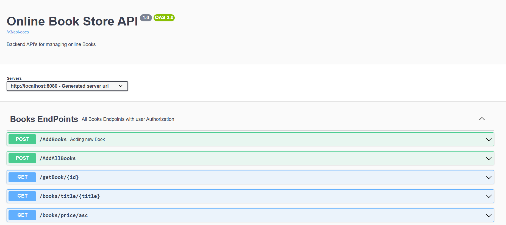
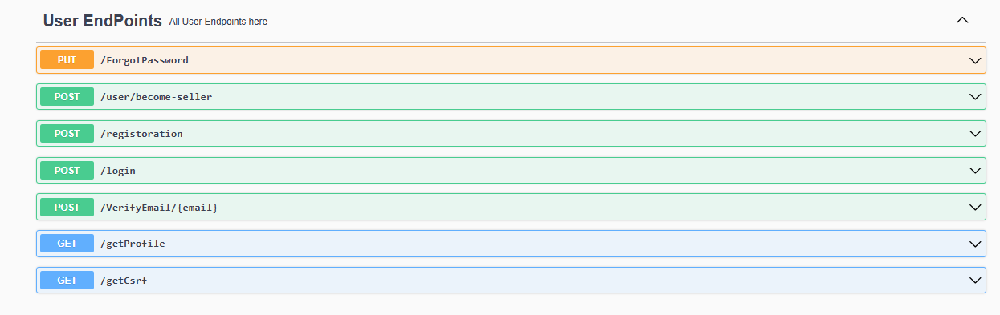
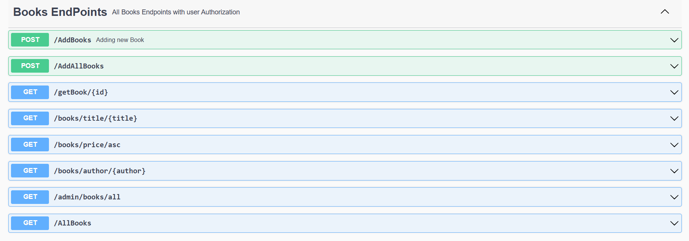
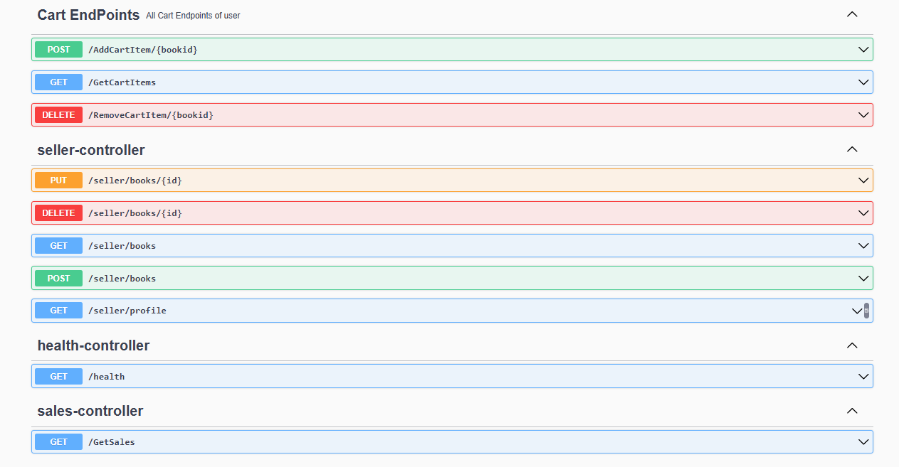
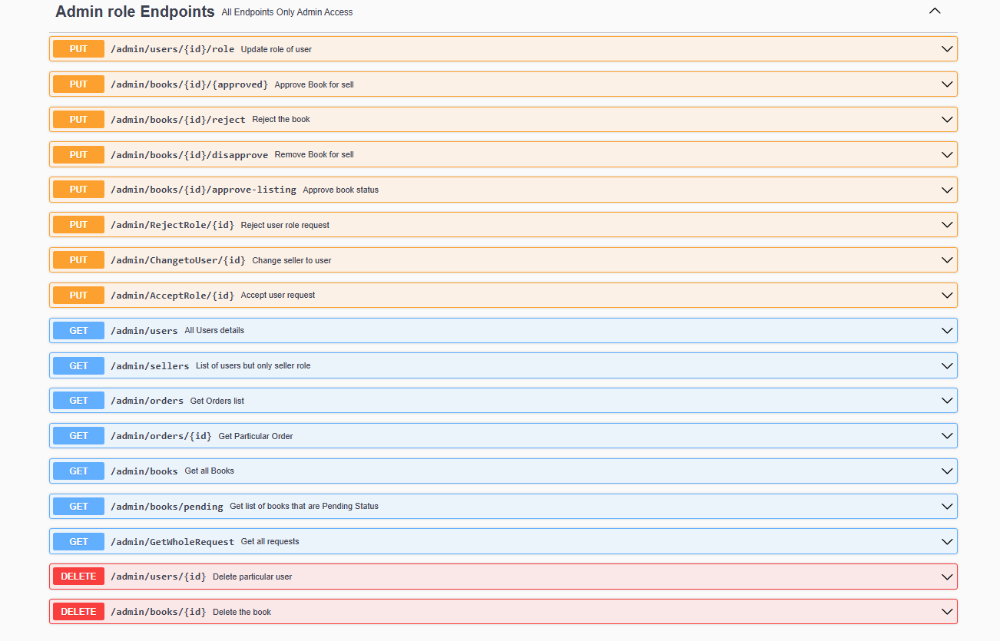
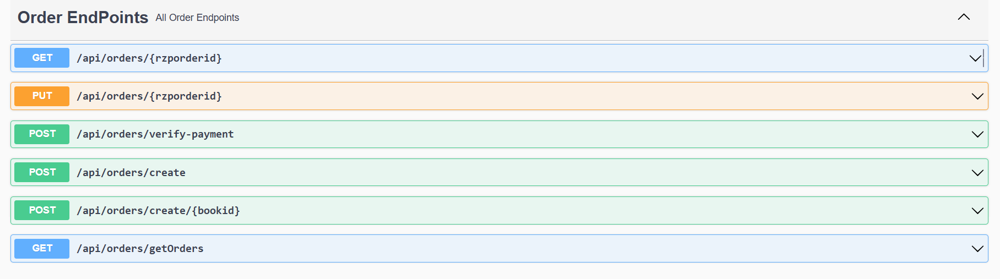
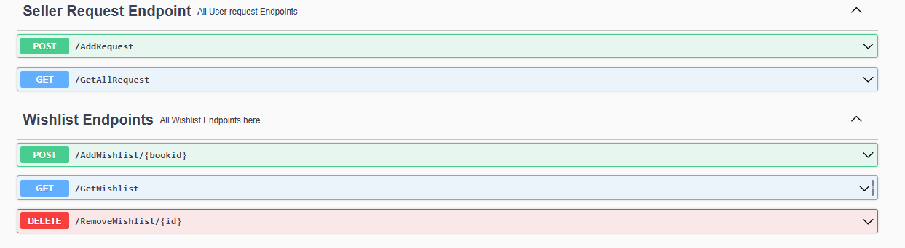
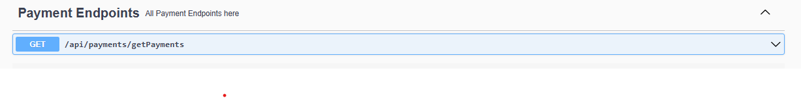

# 📚 Online Book Store API

Backend API for an online bookstore — implemented using Spring Boot and documented with Swagger / OpenAPI.  
All API endpoints, request/response schemas, and usage can be seen via Swagger UI.

---

## 🛠️ Tech Stack

- **Backend:** Spring Boot (Java)  
- **Database:** MySQL  
- **ORM:** Hibernate / JPA  
- **API Documentation:** Springdoc OpenAPI / Swagger  
- **Build Tool:** Maven  

---

## 🚀 Features (What this API supports)

- Book management (add, list, search by title/author/price, get by ID)  
- Order and payment processing  
- User registration, login, role management, seller requests  
- Admin controls (approve/reject books or seller requests, manage users, orders, books)  
- Wishlist, Cart, Seller workflows  
- Purchased-book tracking  
- Authentication & role-based access (for user / admin / seller)  

---

## ⚙️ How to Run Locally

1. Clone the repository  
```bash
git clone https://github.com/MdAqueeb/bookstore.git
cd your-repo-name
```
---


### 2️⃣ Swagger API Documentation

After starting the application, you can view all API endpoints here:

[Swagger UI](http://localhost:8080/swagger-ui/index.html)

## 🖼️ Screenshots

### Swagger UI


### Users API
 

### Books API


### Cart API


### Admin API


### Order API


### Whislist API


### Payment API


### Purchased_Books API

